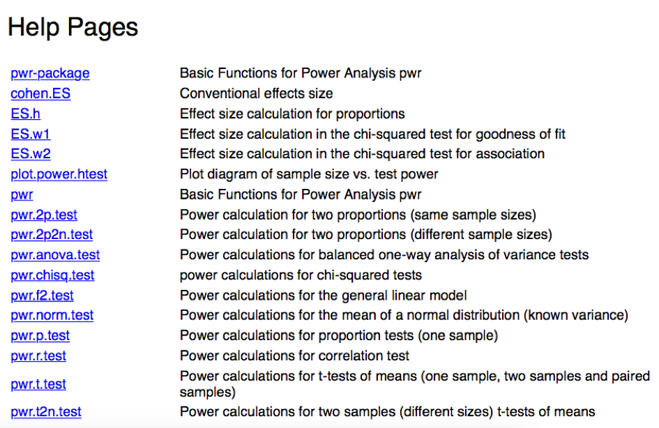

```{r setup, include=FALSE}
knitr::opts_chunk$set(echo = TRUE)
```
## Power Analysis in R

This goes through how to use the package "pwr" in R. This is by no means exhautive of how the package works, but this is what Nicole has done with it. 

### Set-up

First, install and load the package:

```{r load package}
# install 
# install.packages("pwr") - get rid of the '#' to run this line

# load library
library(pwr)
```
***

### Functions 

Here is a list of the different functions in the "pwr" package. You can compute any power analysis or effect size calculation using the functions below. 

```{r functions in pwr, echo=FALSE, out.width = '100%'}

```

***

### An example 

Below is an example of running a Power Analysis for a general linear model that Nicole used for a Variable of Interest (ie., Network Size) and Perspective Taking. This function has 5 defintions; if you fill in 4 of them, it spits out the other one you want. 

In this example, I wanted to know how many subjects I would have to test given my design and desired effect size. I didn't know my effect size, so I tested a range of small, medium and large effect sizes. 

```{r an example of genearl linear model}
## [VARIABLE OF INTEREST] and PT 
# u - numerator df (p - 1; NetworkLD, PPVT, Intercept, 3-1 = 2)
# v - demoniator df (n - p; ? - 3)
# f2 - Cohens f2; small 0.02, medium 0.15, large 0.35 for linear regression
# ^ we don't know the effect size - we'll test all 3 to get a range

# Testing for Small Effect Size = 0.02
pwr.f2.test(u = 2, f2 = 0.02, sig.level = 0.05, power = 0.8)
# v = 482, which means 485 subjects

# Testing for Medium Effect Size = 0.15
pwr.f2.test(u = 2, f2 = 0.15, sig.level = 0.05, power = 0.8)
# v = 64.3, which means 68 subjects 

# Testing for Large Effect Size = 0.35
pwr.f2.test(u = 2, f2 = 0.35, sig.level = 0.05, power = 0.8)
# v = 28, which means 31 subjects 
```
